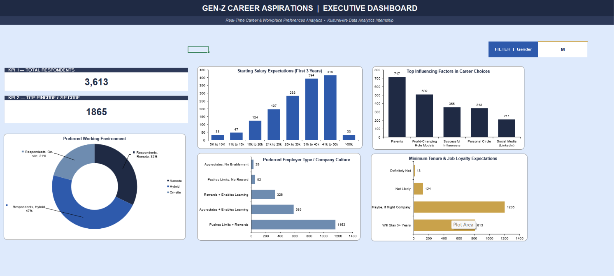
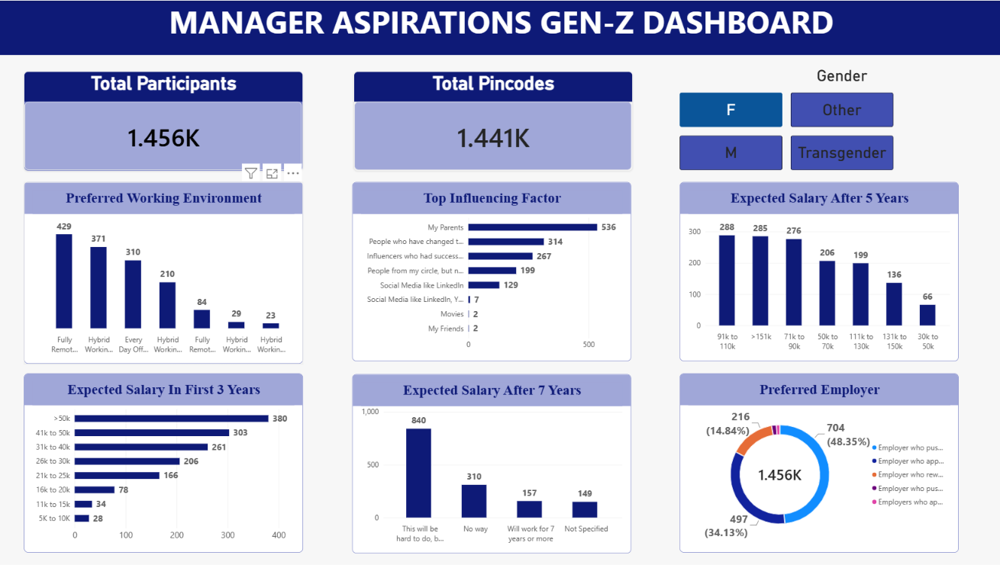
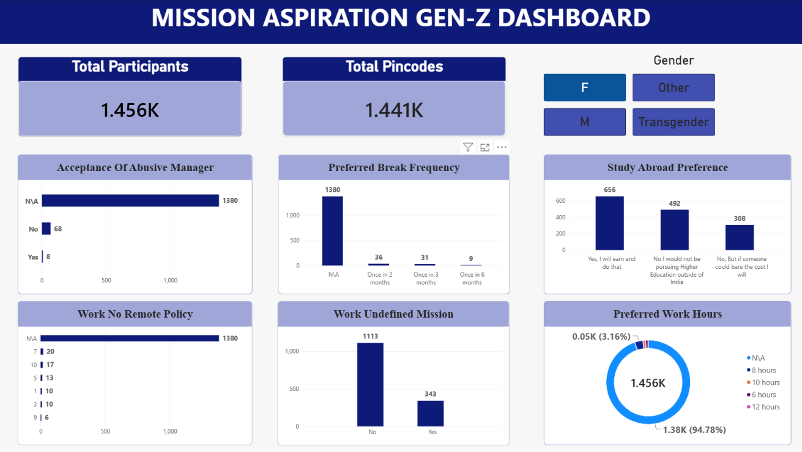

# 📊 Gen Z Career Aspirations — Analytics & Dashboards

A multi-platform data analytics project utilizing **Power BI Desktop** and **Microsoft Excel** to analyze Gen Z career motivators, salary expectations, workplace environment preferences, and long-term retention drivers.

---

## 📸 Dashboard Previews

### 1. Executive Overview (Excel Dashboard)

### 2. Manager & Salary Aspirations (Power BI)

### 3. Mission & Workplace Policies (Power BI)

---

## 💡 Key Insights & Analytics Scope

* **Executive Insights (Excel):** Evaluates overall respondent demographics (3,600+ respondents), top influencers (parents, role models), starting salary distributions, and expected tenure loyalty.
* **Career & Salary Trajectory (Power BI):** Maps 3-year, 5-year, and 7-year salary expectations, preferred leadership traits, and company growth environments.
* **Workplace Culture & Policies (Power BI):** Analyzes employee tolerance regarding work policies, remote flexibility, working hours, and mission alignment.

---

## 📁 Repository Structure

| File Name | Description |
| :--- | :--- |
| `GenZ_Career_aspiration_pbii.pbix` | Full Power BI Desktop project file |
| `excel_dashboard.png` | Excel Executive Dashboard preview |
| `Manager_aspiration_genz_dashboard.png` | Power BI Manager & Salary Aspirations preview |
| `Mission_aspiration_genz_dashboard.png` | Power BI Mission & Workplace Culture preview |

---

## 🛠️ Tools & Technologies

* **Power BI Desktop:** Dynamic cross-filtering, multi-dashboard layout, and interactive slicers
* **Microsoft Excel:** Data aggregation, Pivot Tables, customized chart visuals, and initial KPI modeling
